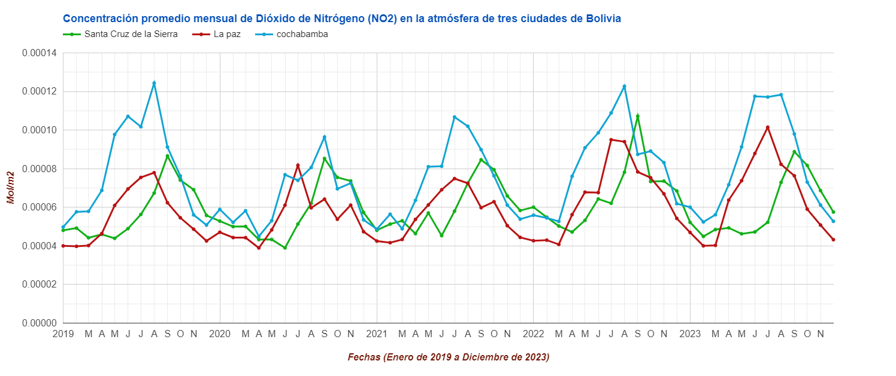
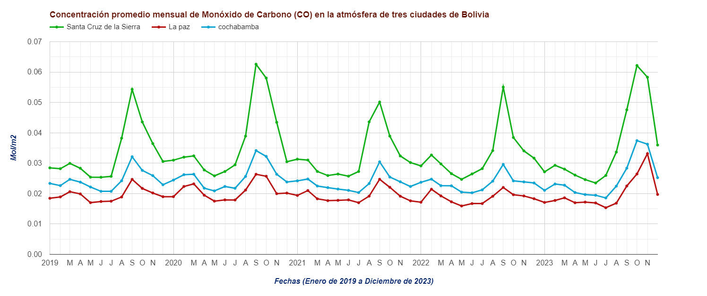

# Concentraciones promedio de NO2 y CO en tres ciudades de Bolivia

Este script muestra como extraer los valores promedios mensuales de tres ciudades de Bolivia, "Santa Cruz de la Sierra, La Paz y Cochabamba" (mediante la ubicación de puntos), para graficar el comportamiento que las concentraciones en la atmósfera (columna total)  del Monóxido de Carbono (CO) y Dióxido de Nitrógeno (NO2) usando datos del instrumento TROPOMI de Sentinel-5.

Las concentraciones graficadas son el promedio mensual para cada año, comenzando desde enero de 2019 hasta diciembre de 2023.

Para crear el presente Script se tomó como referencia el tutorial de "Amirhossein Ahrari" sobre el monitore de CO.

### Datos utilizados
* [Dióxido de Nitrógeno NO2 (Columna total)](https://developers.google.com/earth-engine/datasets/catalog/COPERNICUS_S5P_OFFL_L3_NO2 "Dióxido de Nitrógeno NO2 (Columna total)")
* [Monóxido de Carbono CO (columna total)](https://developers.google.com/earth-engine/datasets/catalog/COPERNICUS_S5P_OFFL_L3_CO "Monóxido de Carbono CO")
* [Límites internacionales (2017)](https://developers.google.com/earth-engine/datasets/catalog/USDOS_LSIB_2017 "Límites internacionales (2017)")

### Metodología
* [Tutorial de Amirhossein Ahrari](https://www.youtube.com/watch?v=E6oguIdM8FQ&t=2138s "Tutorial de Amirhossein Ahrari")

### Resultados

Create by: Jorge A. Zampieri
